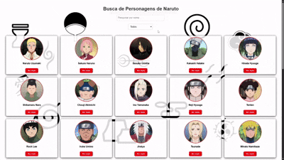

# 🌀 Naruto API

Uma API desenvolvida para listar personagens do universo Naruto. Ideal para projetos de frontend, estudos de consumo de API, e demonstração de habilidades com desenvolvimento back-end.



---

## 🔥 Funcionalidades

- 🔍 Listagem de personagens
- 🧵 Filtro por nome, aldeia, filiação, patente, entre outros.

---

## 🛠️ Tecnologias Utilizadas

- **Java** + **Spring Boot**
- **Spring Web**, **Spring Data JPA**
- **H2 Database**
- **Hibernate**
- **Lombok**
- **HTML/CSS/JS**

---

## 📦 Instalação

1. Clone o repositório:
```bash
git clone https://github.com/vitorh07/naruto-api.git
```
2. Acesse o diretório do projeto:
```bash
cd naruto-api
```
3. Execute o projeto:
```bash
./mvnw spring-boot:run
```

## 🧙‍♂️ Exemplo de JSON
```url
http://localhost:8080/api/characters/1
```
```json
{
  "id": 1,
  "name": "Naruto Uzumaki",
  "genero": "Masculino",
  "estado": "Vivo",
  "ocupacao": "Hokage",
  "afiliacao": "Monte Myouboku",
  "aldeia": "Aldeia da Folha",
  "vila": "Konohagakure",
  "kekkei_genkai": "Não possui",
  "diferencial": "Jinchuuriki",
  "patente": "Genin"
}
```


